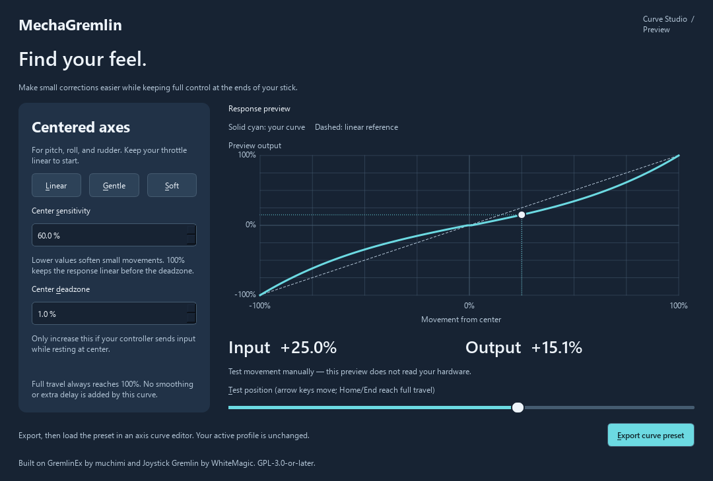

# MechaGremlin

A community-focused redesign of [GremlinEx](https://github.com/muchimi/JoystickGremlinEx), building on [Joystick Gremlin](https://github.com/WhiteMagic/JoystickGremlin).

Our aim: make controllers easy to set up, understand, and tune, while keeping advanced mappings available.

## Current development status

This fork is in early development, not a finished redesign or a packaged release. The first implemented improvement is **Curve Studio**, a native desktop tool for authoring centered-axis response curves:

- Plain-language center sensitivity and deadzone controls.
- Linear, gentle, and soft starting points with full output at both ends.
- Interactive manual input preview with numeric input/output readings.
- Atomic export to GremlinEx's existing XML curve-preset structure.
- No driver initialization required to use the standalone studio.

Curve Studio does not yet read physical controllers, modify the active profile, or send virtual joystick output. Import its exported preset with **Load preset** in the existing axis curve editor, and ensure that axis is mapped to the virtual device your game reads. These presets are starting points, not certified game configurations.

## Run Curve Studio

Use Python 3.12 or later in a virtual environment:

```powershell
python -m venv .venv
.venv\Scripts\python -m pip install -r requirements-studio.txt
.venv\Scripts\python -m mechagremlin.studio
```

Within the full application, open **Tools > Curve Studio**. The complete GremlinEx runtime has additional native dependencies; see the [upstream documentation](https://muchimi.github.io/JoystickGremlinEx/) and [inherited README](README.upstream.md). A successful standalone launch does not verify the hardware runtime.

The inherited application's configuration folder and profile format are unchanged for now. Back up existing profiles before using this development fork alongside GremlinEx.

## Verify the new tools

```powershell
.venv\Scripts\python -m unittest discover -s tests_mechagremlin -v
```

See [the redesign brief](docs/MECHAGREMLIN.md) for the product direction and outstanding milestones. See [the inherited README](README.upstream.md) for upstream history and features.

## Attribution and license

MechaGremlin is an independent fork, not an official GremlinEx or Joystick Gremlin release. Credit belongs to muchimi/EMCS, Lionel Ott/WhiteMagic, and their contributors for the foundation. Existing copyright notices are retained. This project is distributed under GPL-3.0-or-later; see [LICENSE](LICENSE) and individual source headers.

Research and known integration limits are recorded in the [redesign brief](docs/MECHAGREMLIN.md). The first inherited bug fix prevents a calibration deadzone endpoint from becoming stuck after setting it to zero.



[Local validation results and limitations](docs/VALIDATION.md).
